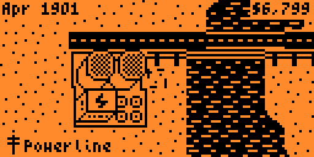

# MicroCity

**A city-building simulation game for Arduboy inspired by SimCity**

## Features

### City Building
- **Zone different areas**: Residential, Commercial, and Industrial
- **Build infrastructure**: Roads and power lines to connect your city
- **Essential services**: Police stations and fire departments
- **Special buildings**: Parks, stadiums, and power plants
- **48×48 tile map** with scrollable viewport

### Simulation
- **Dynamic population growth** based on employment, taxes, and quality of life
- **Crime system** affected by police coverage
- **Fire disasters** that can spread to nearby buildings
- **Pollution mechanics** from industry and traffic
- **Power grid management** - buildings need electricity to thrive

### Economy
- **Starting funds**: $10,000
- **Tax collection** based on population and tax rate
- **Budget management** for roads, police, and fire services

## Screenshots
| | |
|---|---|
|  |  |
|  |  |

## Original (Arduboy)
**James Howard**
[MicroCity](https://github.com/jhhoward/MicroCity)

