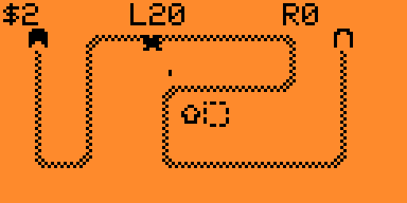
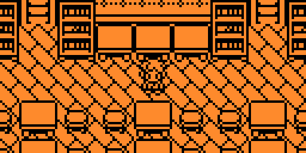
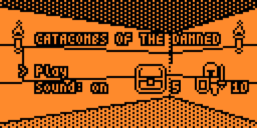
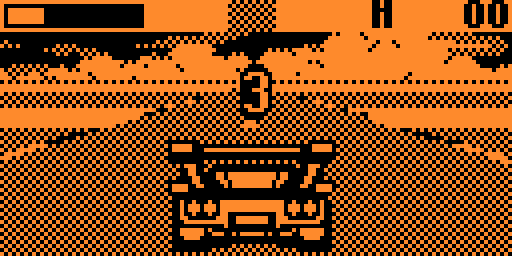

# MyFlipperApps

## TowerDefense
Compact tower defense with upgradeable towers, multiple maps, and wave-based survival.

<table>
<tr>
<td></td>
<td></td>
</tr>
<tr>
<td></td>
<td></td>
</tr>
</table>

### Original (Arduboy)
**Miloslav Ciz**
[MicroTD](https://github.com/drummyfish/microtd)

## MicroCity
City-building sandbox with zoning, utilities, disasters, and budget management.

<table>
<tr>
<td></td>
<td></td>
</tr>
<tr>
<td></td>
<td></td>
</tr>
</table>

### Original (Arduboy)
**James Howard**
[MicroCity](https://github.com/jhhoward/MicroCity)

## Arduventure
Top-down action RPG with exploration, battles, equipment, and a large overworld.

<table>
<tr>
<td></td>
<td></td>
</tr>
<tr>
<td></td>
<td></td>
</tr>
</table>

### Original (Arduboy)
**Team A.R.G. Museum**
[ID-46-Arduventure](https://github.com/Team-ARG-Museum/ID-46-Arduventure)

## CatacombsOfTheDamned
Fast dungeon crawler with procedural levels, fireball combat, and treasure hunting.

<table>
<tr>
<td></td>
<td></td>
</tr>
<tr>
<td></td>
<td></td>
</tr>
</table>

### Original (Arduboy)
**James Howard**
[Arduboy3D](https://github.com/jhhoward/Arduboy3D)

## Drivin
Arcade racing game focused on speed, traffic dodging, and sprite-scaled road action.

<table>
<tr>
<td></td>
<td></td>
</tr>
<tr>
<td></td>
<td></td>
</tr>
</table>

### Original (Arduboy)
**rveilleux**
[ard-drivin](https://github.com/rveilleux/ard-drivin)

## VIRUS LQP-79
Survival shooter where you save survivors in a town overrun by a zombie virus outbreak.

<table>
<tr>
<td></td>
<td></td>
</tr>
<tr>
<td></td>
<td></td>
</tr>
</table>

### Original (Arduboy)
**Team A.R.G. Museum**
[ID-40-VIRUS-LQP-79](https://github.com/Team-ARG-Museum/ID-40-VIRUS-LQP-79)

## CastleBoy
Castlevania-like platformer with challenging gameplay and retro visuals for Flipper Zero.

<table>
<tr>
<td></td>
<td></td>
</tr>
<tr>
<td></td>
<td></td>
</tr>
</table>

### Original (Arduboy)
**jlauener and Increment**
[CastleBoy](https://github.com/jlauener/CastleBoy)
