# MyFlipperApps

Apps for Flipper Zero collected in one repository.

This repository contains multiple applications in one place, excluding large standalone projects which are maintained separately.

Includes an automated system for sourcing and building apps.

## [Tower defense](apps/games/microtd)
Compact tower defense with upgradeable towers, multiple maps, and wave-based survival.

<table>
<tr>
<td>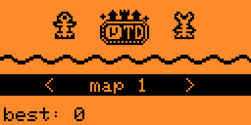</td>
<td>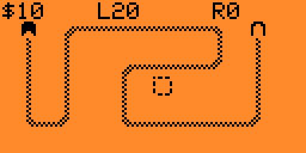</td>
</tr>
<tr>
<td>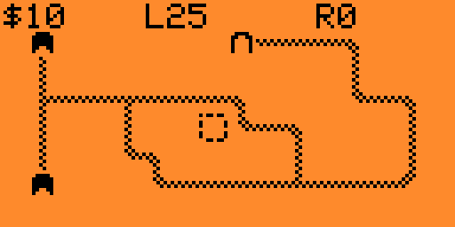</td>
<td></td>
</tr>
</table>

### Original (Arduboy)
**Miloslav Ciz**
[MicroTD](https://github.com/drummyfish/microtd)

## [Ard-drivin](apps/games/arddrivin)
Arcade racing game focused on speed, traffic dodging, and sprite-scaled road action.

<table>
<tr>
<td>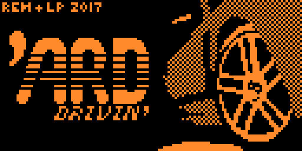</td>
<td></td>
</tr>
<tr>
<td>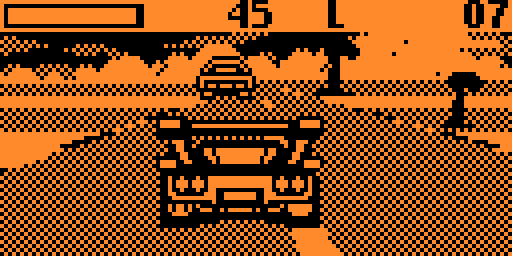</td>
<td>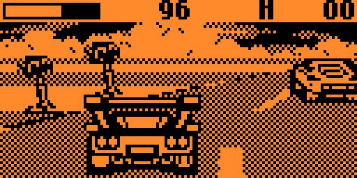</td>
</tr>
</table>

### Original (Arduboy)
**rveilleux**
[ard-drivin](https://github.com/rveilleux/ard-drivin)

## [CastleBoy](apps/games/castleboy)
Castlevania-like platformer with challenging gameplay and retro visuals for Flipper Zero.

<table>
<tr>
<td>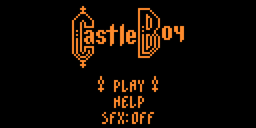</td>
<td>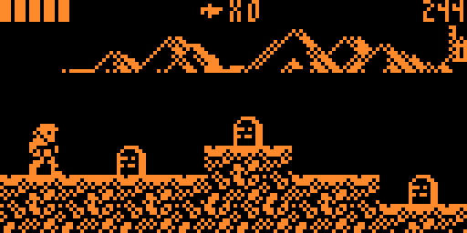</td>
</tr>
<tr>
<td>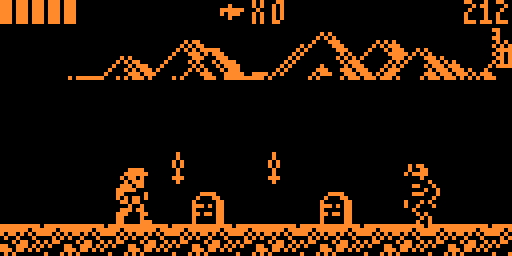</td>
<td>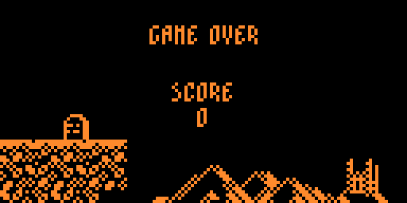</td>
</tr>
</table>

### Original (Arduboy)
**jlauener and Increment**
[CastleBoy](https://github.com/jlauener/CastleBoy)

## [WIP] [ArduGolf](apps/games/ardugolf)
3D minigolf game with solid ball physics. Play through 18 holes, plan your shots, bounce off walls, and use slopes to finish each course in as few strokes as possible.

<table>
<tr>
<td></td>
<td>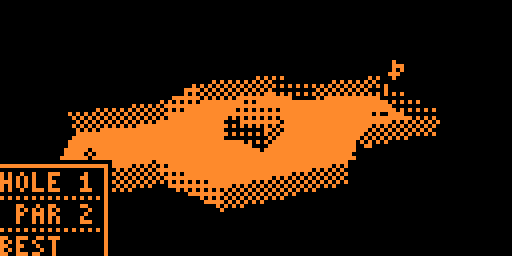</td>
</tr>
<tr>
<td>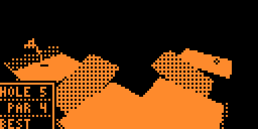</td>
<td>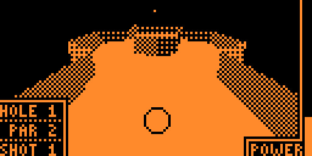</td>
</tr>
</table>

### Original (Arduboy)
**tiberiusbrown**
[ArduGolf](https://github.com/tiberiusbrown/arduboy_minigolf)

## [Virus LQP-79](apps/games/virus_lqp79)
Survival shooter where you save survivors in a town overrun by a zombie virus outbreak.

<table>
<tr>
<td></td>
<td>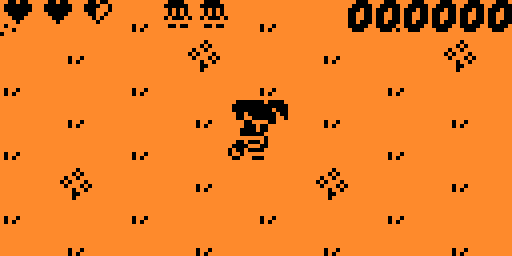</td>
</tr>
<tr>
<td>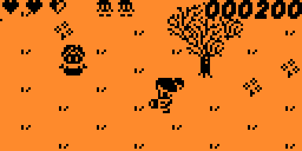</td>
<td>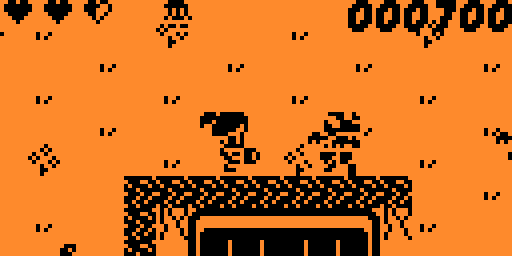</td>
</tr>
</table>

### Original (Arduboy)
**Team A.R.G. Museum**
[ID-40-VIRUS-LQP-79](https://github.com/Team-ARG-Museum/ID-40-VIRUS-LQP-79)

## [MysticBalloon](apps/games/myblab)
Atmospheric platformer where you float through hazard-filled levels using balloons, collect coins, and reach the exit across 39 handcrafted stages.

<table>
<tr>
<td></td>
<td></td>
</tr>
<tr>
<td>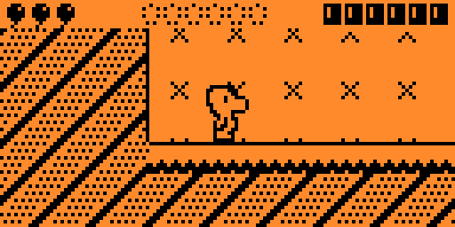</td>
<td>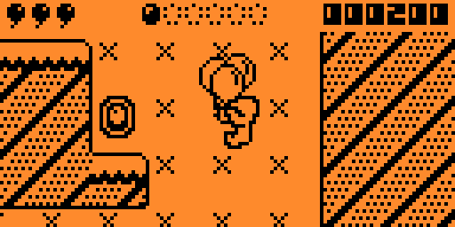</td>
</tr>
</table>

### Original (Arduboy)
**Team A.R.G. Museum**
[ID-34-Mystic-Balloon](https://github.com/Team-ARG-Museum/ID-34-Mystic-Balloon)

## [Arduventure](apps/games/arduventure)
Top-down action RPG with exploration, battles, equipment, and a large overworld.

<table>
<tr>
<td></td>
<td>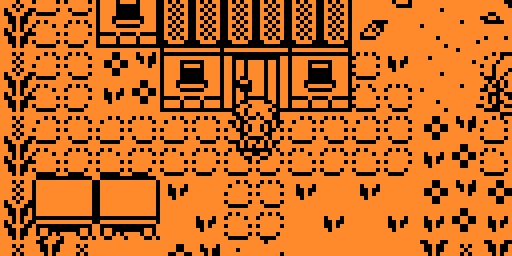</td>
</tr>
<tr>
<td></td>
<td>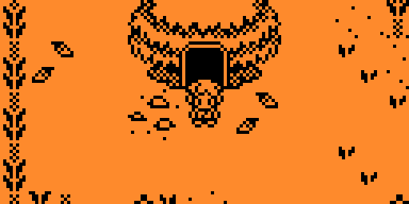</td>
</tr>
</table>

### Original (Arduboy)
**Team A.R.G. Museum**
[ID-46-Arduventure](https://github.com/Team-ARG-Museum/ID-46-Arduventure)

## [Catacombs of the damned!](apps/games/catacombs)
Fast dungeon crawler with procedural levels, fireball combat, and treasure hunting.

<table>
<tr>
<td>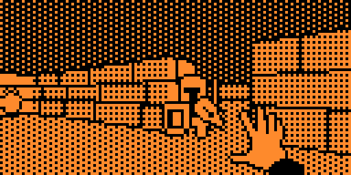</td>
<td></td>
</tr>
<tr>
<td>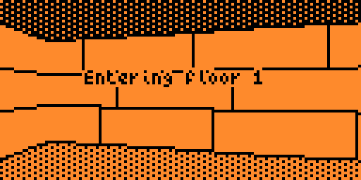</td>
<td>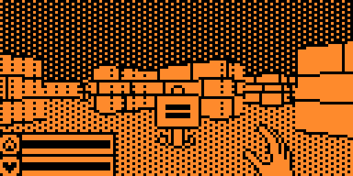</td>
</tr>
</table>

### Original (Arduboy)
**James Howard**
[Arduboy3D](https://github.com/jhhoward/Arduboy3D)

## [MicroCity](apps/games/microcity)
City-building sandbox with zoning, utilities, disasters, and budget management.

<table>
<tr>
<td></td>
<td></td>
</tr>
<tr>
<td>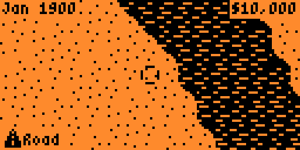</td>
<td></td>
</tr>
</table>

### Original (Arduboy)
**James Howard**
[MicroCity](https://github.com/jhhoward/MicroCity)

## [Wolfenduino](https://github.com/apfxtech/FlipperWolfenduino)
First-person action shooter inspired by Wolfenstein 3D with maze levels, enemies, and weapons.

<table>
<tr>
<td></td>
<td></td>
</tr>
<tr>
<td></td>
<td></td>
</tr>
</table>

### Original (Arduboy)
**James Howard**
[Wolfenduino](https://github.com/jhhoward/WolfenduinoFX)

## [PrinceOfArabia](https://github.com/apfxtech/FlipperPrinceOfArabia)
Cinematic platform adventure with traps, sword fights, and palace escape gameplay.

<table>
<tr>
<td></td>
<td></td>
</tr>
<tr>
<td></td>
<td></td>
</tr>
</table>

### Original (Arduboy)
**Press Play on Tape**
[Prince of Arabia](https://github.com/filmote/PrinceOfArabia)

## [WIP] Ardens
Arduboy simulator Arduboy applications.

<table>
<tr>
<td></td>
<td></td>
</tr>
<tr>
<td></td>
<td></td>
</tr>
</table>

> **Experimental app.**
>  
> This project is currently in a very early and unstable state and requires a full refactor.
> The current implementation should be rewritten in **C** and the emulation/rendering algorithm should be replaced with an approach optimized for **STM32**.
>  
> **Current status:**
> - about half of the games do not start;
> - current performance is extremely low;
> - typical FPS is around **0.5-1**.
> - Disable usb and buzzer
>  
> At this stage, this repository should be treated only as an experiment/proof of concept, not as a usable Arduboy emulator for Flipper Zero.

## Flipper Zero Port
[FlipperArdens](https://github.com/apfxtech/FlipperArdens)

## Original
**Tiberius Brown**  
[Ardens](https://github.com/tiberiusbrown/ardens)

